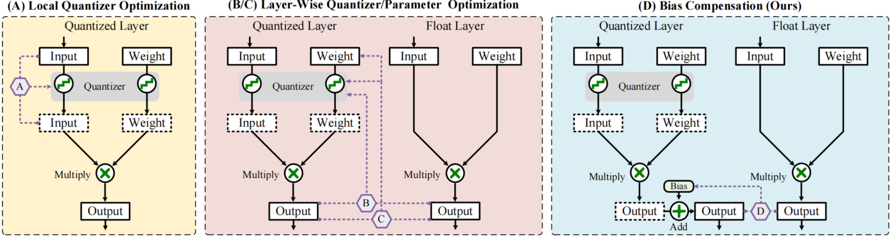
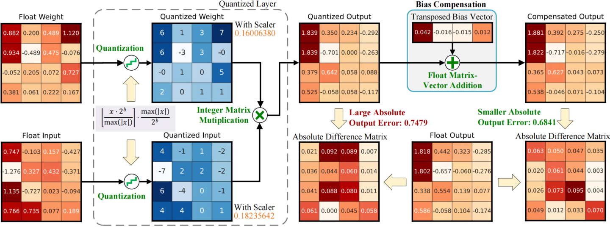

# Minimize Quantization Output Error with Bias Compensation

This repo is the official implementation of "Minimize Quantization Output Error with Bias Compensation" (CAAI AIR 2024).
> Autthors: [Cheng Gong](https://scholar.google.com/citations?user=SOUobmQAAAAJ), Haoshuai Zheng, [Mengting Hu](https://scholar.google.com/citations?user=cYxJCNIAAAAJ), [Zheng Lin](https://scholar.google.com/citations?user=aCKl1R0AAAAJ), [Deng-Ping Fan](https://scholar.google.com/citations?user=kakwJ5QAAAAJ), Yuzhi Zhang, Tao Li

[[arXiv](https://arxiv.org/abs/2404.01892)][[Code](https://github.com/GongCheng1919/bias-compensation)]

## Description

Bias Compensation (BC) is novel method aiming to minimize the output error caused by quantization, thus realizing ultra-low-precision quantization without model fine-tuning. 
Instead of optimizing the non-convex quantization process as in most previous methods, the proposed BC bypasses the step to directly minimize the quantizing output error by identifying a bias vector for compensation. 
We have established that the minimization of output error through BC is a convex problem and provides an efficient strategy to procure optimal solutions associated with minimal output error, without the need for training or fine-tuning. 
We conduct extensive experiments on Vision Transformer models and Large Language Models, and the results show that our method notably reduces quantization output error, thereby permitting ultra-low-precision post-training quantization and enhancing the task performance of models. Especially, BC improves the accuracy of ViT-B
with 4-bit PTQ4ViT by **36.89%** on the ImageNet-1k task, and decreases the perplexity of OPT-350M with 3-bit GPTQ by **5.97** on WikiText2.


Figure 1 shows the comparison between the previous PTQ methods and our proposed bias compensation. 
(A) indicates local quantizer optimization
methods. (B) and \(C\) are layer-wise quantizer and parameter optimization methods, respectively. Previous methods optimize the quantizer
parameter or layer-wise weights to minimize the quantization loss or output error, which is non-convex and difficult to solve. Our method
shown in (D) directly minimizes the output error by solving the best bias vector, which is convex and guarantees minimal output error.



Figure 2 shows the detailed application of bias compensation for a quantized layer or quantized block.
We use absolute error as output error in this figure for easy understanding. 
Applying bias compensation after quantization can significantly reduce the output error without increasing additional computational complexity.




 In summary, BC is a valuable approach as it provides another method to improve the task performance of quantized models other than optimizing quantizers. 
 BC is both simple (without increasing time and space complexity) and effective (outperforming the latest methods, such as GPTQ and AWQ) while being decoupled with quantizers (can be combined with different quantizers). 
 It differs from previous PTQ and QAT methods, as it is the first approach to be directly applied to correct the output error after the quantization layer.

## Installation
You can clone this project, then enter this bias-compensation folder, and install this project as shown below.
```bash
$ git clone https://github.com/GongCheng1919/bias-compensation.git
$ cd bias-compensation
$ python setup.py install
```

## Usage

You can utilize bias compensation as a torch nn module and incorporate it at any position within a neural network architecture. 
The pseudocode example below demonstrates its usage:

```python
from bias_compensation.quantizers.BiasCompensation import BiasCompensation
from bias_compensation.quantize.quantize import quantize_module_act
layer = Float_Layer
## Your quantiziation code should be here ##
q_layer = Quantized_Layer
channel_size = Bias_Vector_Size
channel_axis = Bias_Vector_Axis
bc = BiasCompensation(channel_size=channel_size, channel_axis=channel_axis)
## Apply this quantizer to the layer output ##
quantize_module_act(q_layer,bc,act_id=0,pre=False)
## Conduct your Calibra_Data ##
calibra_data = Calibra_Data
float_output = layer(calibra_data)
quantized_output = q_layer(calibra_data)
## Optimize the bias vector ##
bc.update(float_output,quantized_output)
```

For a detailed usage example, please refer to [this file](./quantize-demo.ipynb).

## Experimental Results


**Results on ViTs:** 
We take the PTQ4ViT as the base quantizer for BC and the quantizers including Base PTQ, EasyQuant, APQ-ViT, NoisyQuant, and RepQ-ViT as baselines for comparison.
The experimental results of the baselines are cited from their original paper, and the results of PTQ4ViT are obtained based on the [open implementation](https://github.com/hahnyuan/PTQ4ViT).
The results are shown below (The default input resolution is 224 × 224, and * means 384 × 384).
| Model | W/A | ViT-S | ViT-B | ViT-B*| Deit-S | Deit-B | Deit-B* | Swin-T | Swin-S | Swin-B | Swin-B* |
| ----- | --- | ----- | ----- | --------- | ------ | ------ | ---------- | ------ | ------ | ------ | ---------- |
| # Parameter(M) | - | 22.1 | 86.6 | 86.9 | 22.4 | 86.6 | 86.9 | 28.3 | 49.9 | 88.1 | 90.8 |
| FP32 | 32/32 | 81.39 | 84.54 | 86.00 | 79.85 | 81.80 | 83.11 | 81.39 | 83.23 | 85.27 | 86.44 |
| Base PTQ | 8/8 | 80.46 | 83.89 | 85.35 | 77.65 | 80.94 | 82.33 | 80.96 | 82.75 | 84.79 | 86.16 |
| EasyQuant | 8/8 | 80.75 | 83.89 | 85.53 | 78.98 | 81.19 | 82.10 | 80.95 | 83.00 | 85.10 | 86.39 |
| PTQ4ViT | 8/8 | 81.00 | 84.25 | 85.82 | 79.47 | 81.48 | 82.97 | 81.24 | 83.10 | 85.14 | 86.39 |
| APQ-ViT | 8/8 | **81.25** | 84.26 | - | **79.78** | 81.72 | - | - | 83.16 | 85.16 | 86.40 |
| NoisyQuant | 8/8 | 81.15 | 84.22 | 85.86 | 79.51 | 81.45 | 82.49 | 81.25 | 83.13 | 85.20 | **86.44** |
| **PTQ4ViT+BC** | 8/8 | 81.15 | **84.33** | **85.96** | 79.58 | **81.76** | **83.12** | **81.34** | **83.18** | **85.21** | **86.44** |
| Base PTQ | 6/6 | 70.24 | 75.66 | 46.88 | 72.26 | 78.78 | 68.44 | 78.45 | 81.74 | 83.35 | 85.22 |
| EasyQuant | 6/6 | 75.13 | 81.42 | 82.02 | 75.27 | 79.47 | 81.26 | 79.51 | 82.45 | 84.30 | 85.89 |
| PTQ4ViT | 6/6 | 78.63 | 81.65 | 83.34 | 76.28 | 80.25 | 81.55 | 80.47 | 82.38 | 84.01 | 85.38 |
| APQ-ViT | 6/6 | 79.10 | 82.21 | - | 77.76 | 80.42 | - | - | 82.67 | 84.18 | 85.60 |
| NoisyQuant | 6/6 | 78.65 | 82.32 | 83.22 | 77.43 | 80.70 | 81.65 | 80.51 | **82.86** | **84.68** | **86.03** |
| RepQ-ViT | 6/6 | **80.43** | **83.62** | - | **78.90** | 81.27 | - | - | 82.79 | 84.57 | - |
| **PTQ4ViT+BC** | 6/6 | 79.22 | 83.00 | **85.00** | 78.60 | **81.29** | **82.44** | **80.56** | 82.46 | 84.28 | 85.60 |
| PTQ4ViT | 4/4 | 34.02 | 35.30 | 31.40 | 24.05 | 60.72 | 75.93 | 74.46 | 76.46 | 74.49 | 77.26 |
| APQ-ViT | 4/4 | 47.95 | 41.41 | - | 43.55 | 67.48 | - | - | 77.15 | 76.48 | **80.84** |
| RepQ-ViT | 4/4 | **65.05** | **68.48** | - | **69.03** | 75.61 | - | - | **79.45** | **78.32** | - |
| **PTQ4ViT+BC** | 4/4 | 54.74 | 67.27 | **68.29** | 67.47 | **75.78** | **80.15** | **74.74** | 76.79 | 77.78 | 79.97 |

You can use following commend to obtain these results.
```bash
$ bash ./script/vits/run-vit-deit-swin.sh
```

**Results on LLMs:** 
We take the naive Rounding-To-Nearest (NTR) (implemented in GPTQ), GPTQ and AWQ as baselines in this experiment.
We use the [open implementation](https://github.com/IST-DASLab/gptq) of GPTQ and pre-trained quantized LLM models in HuggingFace to obtain reproducible results.
| Method | Bits | Wiki. (OPT-125M) | PTB (OPT-125M) | C4 (OPT-125M) | Wiki. (OPT-350M) | PTB (OPT-350M) | C4 (OPT-350M) | Wiki. (BLOOM-560M) | PTB (BLOOM-560M) | C4 (BLOOM-560M) |
| ------ | ---- | ------------------- | -------------- | ------------- | ------------------- | -------------- | ------------- | ---------------------- | ----------------- | ---------------- |
| FP16 | 16 | 27.66 | 32.55 | 24.61 | 22.00 | 26.08 | 20.71 | 22.42 | 41.26 | 24.38 |
| RTN | 4 | 37.28 | 45.11 | 31.64 | 25.94 | 31.12 | 23.94 | 25.89 | 48.57 | 27.42 |
| GPTQ | 4 | 31.22 | 36.93 | 26.94 | 24.20 | 28.89 | 22.60 | 23.98 | 44.53 | 25.60 |
| **GPTQ+BC** | 4 | **29.90** | **36.11** | **26.03** | **22.85** | **27.23** | **21.34** | **23.77** | **44.44** | **25.46** |
| RTN | 3 | 1276.92 | 1209.34 | 731.60 | 64.56 | 81.85 | 50.14 | 56.98 | 117.15 | 58.96 |
| GPTQ | 3 | 54.68 | 65.74 | 38.27 | 33.75 | 38.66 | 28.53 | 32.45 | 62.66 | 32.25 |
| **GPTQ+BC** | 3 | **45.19** | **52.15** | **33.78** | **27.78** | **33.79** | **24.79** | **31.49** | **60.36** | **31.35** |
| RTN | 2g64 | 7042.44 | 5057.60 | 3869.38 | 4354.61 | 3560.32 | 2346.04 | 502.39 | 627.17 | 326.20 |
| GPTQ | 2g64 | 192.96 | 200.53 | 114.07 | 519.97 | 506.01 | 231.55 | 74.06 | 182.64 | 59.23 |
| **GPTQ+BC** | 2g64 | **108.98** | **137.12** | **70.11** | **88.09** | **95.57** | **56.17** | **69.12** | **178.73** | **56.43** |

You can use following commend to obtain these results.
```bash
$ bash ./script/llms/run-opt-bloom.sh
```

Besides, we also conduct a comparison of GPTQ, [AWQ](https://github.com/mit-han-lab/llm-awq) and GPTQ+BC below.
| Method | Bits | Wiki. (OPT-125M) | PTQ (OPT-125M) | C4 (OPT-125M) | Wiki. (BLOON-560M) | PTQ (BLOON-560M) | C4 (BLOON-560M) |
| ------ | ---- | --------------- | -------------- | ------------- | ------------------ | ---------------- | --------------- |
| FP16 | 16 | 27.66 | 32.55 |  24.61 | 22.42 | 41.26 | 24.38 |
| RTN | 4 | 37.28 | 45.11 | 31.64  |25.89 |48.57 |27.42 |
| GPTQ | 4 | 31.22 | 36.93 |  26.94 | 23.98 | 44.53 | 25.60 |
| **GPTQ+BC** | 4 | **29.90** |**36.11** | **26.03** | **23.77**| **44.44** |**25.46** |
| GPTQ | 4g256 | 30.16 | 35.78 | 26.38 | 23.39| 42.99| 25.08 |
| AWQ | 4g256 | 30.38 |35.23 | 26.35 | 28.45 | 52.93|34.96 |
| **GPTQ+BC** | 4g256 | **28.99**|**33.96** |**25.40** | **23.24**| **42.68**| **24.97**|
| GPTQ | 4g128 | 29.79| 35.25| 25.95| 23.23| 42.72| 24.93|
| AWQ | 4g128 | 29.14 |34.96 | 25.90 | 28.22|	55.37|34.93|
| **GPTQ+BC** | 4g128 | **28.50**|**33.77** | **25.21**| **23.10**| **42.68**| **24.83**|
| RTN | 3 | 1276.92 | 1209.34 | 731.60 | 56.98 | 117.15 | 58.96 |
| GPTQ | 3 | 54.68 | 65.74 | 38.27 | 32.45 | 62.66 | 32.25 |
| **GPTQ+BC** | 3 | **45.19** | **52.15** | **33.78** | **31.49** | **60.36** | **31.35** |
| GPTQ | 3g256 |41.64 | 52.96|32.46 | 26.76| 51.06|28.11|
| AWQ | 3g256 | 41.87 | 50.92 |35.55 | 33.21 | 62.04 | 41.32 |
| **GPTQ+BC** | 3g256 | **35.65**| **44.33**| **29.04**| **26.35**|**50.11** | **27.69**|
| GPTQ | 3g128 |37.78 | 43.20|30.00 | 25.52|48.44 |27.15|
| AWQ | 3g128 | 36.52 | 44.02 | 32.02|  31.77 | 62.97 | 39.66 |
| **GPTQ+BC** | 3g128 | **33.63**| **39.54**| **27.79**| **25.15**| **47.51**| **26.84**|
| RTN | 2g64 | 7042.44 | 5057.60 | 3869.38 | 502.39 | 627.17 | 326.20 |
| GPTQ | 2g64 | 192.96 | 200.53 | 114.07 | 74.06 | 182.64 | 59.23 |
| AWQ | 2g64 | 133.27 | 147.97 | 97.18| 111.49 | 316.53| 145.12  |
| **GPTQ+BC** | 2g64 | **108.98** | **137.12** | **70.11** | **69.12** | **178.73** | **56.43**|

It can be seen that AWQ performs better than GPTQ on OPT, and GPTQ+BC consistently outperforms GPTQ and AWQ on all datasets and configurations.

You can use following commend to obtain these results.
```bash
$ bash ./script/llms/run-grouping-q.sh
```

We conduct a comparison of the latest BiLLM quantization, [BiLLM](https://github.com/Aaronhuang-778/BiLLM) and BiLLM+BC below.
| Method | Bits | Wiki. (OPT-125M) | PTB (OPT-125M) | C4 (OPT-125M) | Wiki. (OPT-350M) | PTB (OPT-350M) | C4 (OPT-350M) |  Wiki. (LLaMA-7B) | PTB (LLaMA-7B)| C4 (LLaMA-7B) |
| ------ | ---- | ------------------- | -------------- | ------------- | ------------------- | -------------- | ------------- | ---------------------- | ----------------- | ---------------- |
| FP16 | 16 | 27.66 | 32.55 | 24.61 | 22.00 | 26.08 | 20.71 | 5.68 | 41.15 | 7.34 |
| BiLLM | 2-order binary | 2409.61 | 2581.31 | 1632.83| 1949.35| 2567.82| 822.90 | 35.10 | 351.01  | 40.32 | 
| BiLLM+BC | 2-order binary | **348.64** |**362.20** | **199.67** | **116.31** | **138.91** | **100.99** | **22.51** | **348.88** | **26.17** |

The results show that BC can significantly improve the performance of BiLLM across various LLMs and datasets.

## Reference

If you find bias compensation useful or relevant to your research, you can cite their [paper](https://arxiv.org/pdf/2404.01892.pdf):
```
@article{gong2024minimize,
    title={Minimize Quantization Output Error with Bias Compensation},
    author={Cheng Gong and Haoshuai Zheng and Mengting Hu and Zheng Lin and Deng-Ping Fan and Yuzhi Zhang and Tao Li},
    year={2024},
    journal = {CAAI Artificial Intelligence Research (CAAI AIR)},
}
```


<!-- The code for the quantization API is referenced from the AutoQNN project.
```
@article{JCST-2105-11632,
    author = {Cheng Gong and Ye Lu and Su-Rong Dai and Qian Deng and Cheng-Kun Du and Tao Li},
    title = {AutoQNN: An End-to-End Framework for Automatically Quantizing Neural Networks},
    journal = {Journal of Computer Science and Technology (JCST)},
    volume = {39},
    number = {2},
    pages = {401-420},
    year = {2024}
}
``` -->
